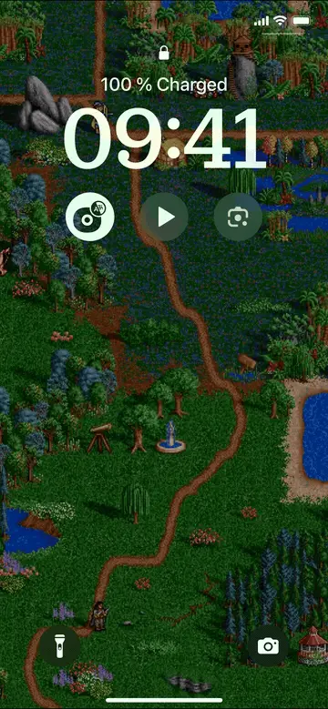

# HoMM2 map wallpapers for iPhone

Renders random views of Heroes of Might and Magic II adventure maps on a Mac and turns them into Live Photos that the iPhone lock screen plays as moving wallpapers. The phone needs only built-in apps: a synced Photos album and a daily Shortcuts automation. iOS has no live wallpaper API for third-party apps, so this is the closest equivalent; [docs/findings.md](docs/findings.md) explains why it works the way it does.

<p align="center">
  
</p>

Every morning a new wallpaper appears on the lock and home screen. When the phone wakes, the lock screen plays about 1.7 s of map animation (units, flags, water, a slow pan), then settles on the still.

A fan project, not affiliated with or endorsed by Ubisoft, the current owner of Heroes of Might and Magic, or by the game's makers, New World Computing and 3DO. It includes no game files: the art comes from your own copy of the game or the free demo.

## Quick start

1. Install the tools: Xcode Command Line Tools (`xcode-select --install`), [Homebrew](https://brew.sh), [uv](https://docs.astral.sh/uv/), then `brew install sdl2 sdl2_mixer ffmpeg gpac exiftool imagemagick libheif`.
2. Get the code and build the renderer: `git clone <this repo>`, `cd` into it, `./build.sh` (under a minute on a recent Mac).
3. Have game data (see [Game data](#game-data)), or run `uv run h2live get-demo`.
4. Make wallpapers: `uv run h2live batch --count 30`. They go into the Photos album "H2".
5. Sync the album to the iPhone and set up the shortcut ([Get them onto the iPhone](#get-them-onto-the-iphone), [Rotate them on the iPhone](#rotate-them-on-the-iphone)).

## Game data

The renderer draws with the game's graphics archive, `DATA/HEROES2.AGG`, and uses the maps next to it in `MAPS`. Any one of these works:

- **fheroes2 with the game's files.** If you play HoMM2 through [fheroes2](https://github.com/ihhub/fheroes2), its data folder `~/Library/Application Support/fheroes2` is used by default.
- **An original install** (CD, GOG): pass `--game-data <folder>`, the folder that holds `DATA` and `MAPS`. On a Mac, a GOG copy keeps them inside the app: right-click it, choose Show Package Contents, and look for the folder that contains both.
- **The free demo.** `uv run h2live get-demo` downloads the 1996 demo (22 MB) from archive.org, the same file fheroes2 offers, and keeps only its graphics archive and its one map in `~/Library/Application Support/h2live/demo`. The demo's graphics archive holds the full game's map art, so wallpapers look the same; the demo map plus the bundled maps give about 190 distinct views. It's used when no fheroes2 game data is found. Please don't redistribute it.

Without any of them, `h2live batch` stops and lists these options.

## Build

```sh
./build.sh
```

Use the script, not plain `make`: it builds a release engine (developer assertions abort on some maps) and puts a fresh copy at `engine/fheroes2` (macOS kills a binary that `make` overwrote in place).

## Make wallpapers

```sh
uv run h2live batch --count 30
```

This scouts the maps, picks views that pass the [selection rules](#selection-rules), renders them, builds Live Photos and imports them into the Photos album "H2". The first import asks for permission for your terminal app to control Photos; allow it. Each wallpaper is about 3 MB and takes about 4 s on an M3 Pro MacBook Pro; the first run also scouts every map once.

Options (`uv run h2live batch --help` lists them all):

| Option | Default | Effect |
|---|---|---|
| `--count` | 60 | wallpapers to make |
| `--album` | H2 | Photos album to add them to |
| `--scale` | 3 | screen pixels per map pixel (2-4) |
| `--brightness` | 70 | percent; dims the map so the clock stays readable |
| `--no-import` | | build the files in `~/Downloads/h2live-<date>/live` and skip Photos |
| `--game-data` | see [Game data](#game-data) | folder with `DATA` and `MAPS` |
| `--reuse` | | allow views used by earlier batches |
| `--seed` | | makes the choice of views and pans repeatable |
| `--out` | | work in this folder instead |

- **No repeats across batches.** Every batch appends its views to `~/Library/Application Support/h2live/used-views.txt`, and later batches skip anything overlapping them. When too few unused views are left, the batch stops and says how many it found.
- **Maps** come from the game data's `MAPS` folder (`.mp2`, `.mx2`, `.fh2m`) plus fheroes2's 11 bundled `.fh2m` maps in `engine/maps`. The scout cache (`~/Library/Caches/h2live`) remembers each map file by size and date, so the next batch scouts only new or changed maps and drops removed ones. Maps the engine can't load are remembered and skipped; other failures are retried next time. Rebuilding the renderer or switching game data rescouts everything.
- **Where it works.** In a folder under `~/Library/Caches/h2live/work/`, deleted after a successful import: Photos keeps its own copy of every file, and the history records the views. If a step fails, the folder stays and its path is printed.

## Get them onto the iPhone

The wallpapers must arrive in the iPhone's Photos app as Live Photos with their metadata intact.

| Path | Suits | Status |
|---|---|---|
| Finder photo sync | iCloud Photos off on the iPhone; the album updates on the phone when you sync | Verified |
| AirDrop from the Photos app on the Mac | Anyone; one-off batches | Verified (from Finder it sends two separate files) |
| iCloud Photos | iCloud Photos on; the album syncs by itself | Untested: whether the wallpaper metadata survives iCloud is unknown |

Finder photo sync, one-time setup:

1. Connect the iPhone by cable, unlock it, trust the Mac.
2. Finder → iPhone → General: tick "Show this iPhone when on Wi-Fi".
3. Photos tab: tick "Sync photos to your device from: Photos", choose "Selected albums", tick **H2**, keep "Include videos" ticked. Apply.

After that, a sync starts when you select the iPhone in Finder's sidebar (cable, or Wi-Fi while the phone is awake or charging). The album appears on the phone read-only. Synced photos keep their Live Photo motion, don't count against iCloud storage, and aren't picked up by Google Photos. Keep the album in Photos on the Mac: sync mirrors it, so photos removed there disappear from the phone at the next sync.

With AirDrop or iCloud Photos the wallpapers land in the camera roll, where backup apps such as Google Photos pick them up. They're all dated 1 January 1996, which keeps them out of the recent timeline and makes them easy to find and delete in one go.

## Rotate them on the iPhone

Make a shortcut in the Shortcuts app with two actions: **Find Photos** (Album is H2, Sort by Random, Limit 1) → **Set Wallpaper Photo** (Lock Screen and Home Screen). Expand Set Wallpaper Photo with › and turn **Show Preview** off, or automations report success and change nothing.

Ways to run it:

- **Daily:** Automation → Time of Day (e.g. 05:00, Daily, Run Immediately, Notify When Run off). Time of Day also offers weekly and monthly.
- **On an event:** Automation triggers such as connecting the charger, an alarm going off or a Focus turning on.
- **By hand:** add the shortcut to the Home Screen or as a widget.
- **Lock screen only:** choose Lock Screen instead of both in Set Wallpaper Photo; only the lock screen plays the motion anyway.
- **No automation at all:** pick a wallpaper in Settings → Wallpaper → Add New → Photos, with the Live Photo button on.

On iOS 18, Set Wallpaper Photo fails on about every other run ("NSXPC connection type unavailable for com.apple.PhotosUIPrivate.PhotosPosterProvider"). Shortcuts has no retry, so add a second automation a minute after the first.

To see which wallpaper is on (optional): after Set Wallpaper Photo, add **Get Details of Images** (Date Taken, of the Find Photos result) → **Append to Note** (e.g. a note "H2 wallpapers"). A wallpaper's capture time identifies it: the minutes after 12:00 on 1 January 1996 are its position in `used-views.txt`, counting from 0 and skipping the `#` lines, and that line gives the map file and the view's top-left tile. The file name won't do: synced photos' names read as UUIDs on the phone.

## Selection rules

A view is used only if it passes every rule (`h2live/select.py`). The thresholds were calibrated against the author's verdicts on contact sheets, pinned in `tests/test_sheet_verdicts.py`. Objects include trees, mountains and ground decorations; borders between terrains count as content, roads and rivers don't.

| Rule | Fails when |
|---|---|
| Empty | a 6×6-tile patch has no object and no terrain border |
| Clumped | over 45% of the view lies in blank 2×2 patches |
| Sparse | under 22% of tiles hold objects |
| Repetition | 3 identical objects in a straight evenly spaced line, or a 2×2 block of identical objects |
| Frequency | one sprite has 8+ copies covering over 65% of the objects' area |
| Monoculture | one object type covers over 65% of occupied tiles |
| Few types | fewer than 3 object types |
| Animation | fewer than 2 animated objects and fewer than 4 water/lava tiles |
| Pan / overlap | the pan would leave the map, or the view overlaps an already chosen view of the same map |

To recalibrate: `uv run python -m h2live.calibrate <out-dir>` renders a contact sheet of views just either side of each threshold.

## Tests

```sh
uv run pytest
```

Engine tests skip unless `engine/fheroes2` is built and game data is found. With only the demo, a few tests of the engine's random-map mode, which h2live doesn't use, skip too. The calibration tests need the author's fan-made maps and skip without them.

## License

GPL-2.0-or-later (see [LICENSE](LICENSE)), the same as the fheroes2 engine in `engine/`, which also includes libsmacker under LGPL-2.1-or-later (see [engine/README.md](engine/README.md) for what was changed). `base/` holds goLive's sample Live Photo under Apache-2.0 (see [base/NOTICE.md](base/NOTICE.md)). Rendering needs Heroes of Might and Magic II game data, which is not included.
